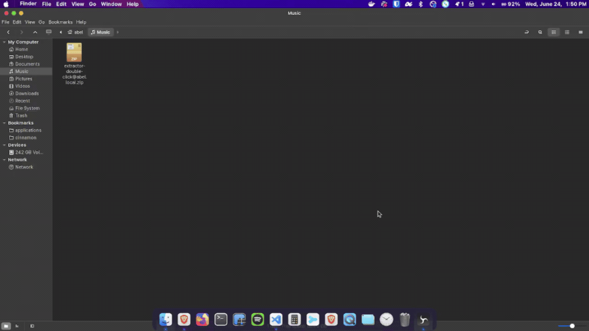

# Extractor Double Click
You can extract files like you see in macOS. With just a double click.

## Summary

## How To Install?
You have two ways:
1. Generate a `.deb` file;
2. Running the `.sh` script;

For create a Debian file, please take a look at: [debian-file-generator.md](./debian-file-generator.md) and follows the steps there.

For install without a debian file, you have the file: [install.sh](./install.sh). To run, just type:
```bash
bash install.sh
```

## How To Uninstall?
For uninstall, it depends on the way, the debian package documentation describes the steps if you created a debian.

But by script, just run the file [uninstall.sh](./uninstall.sh).
```bash
bash uninstall.sh
```

This command reverts the system because the installation proccess make a backup from mimetypes.

## Demonstations


---
_That's All Folks!_
